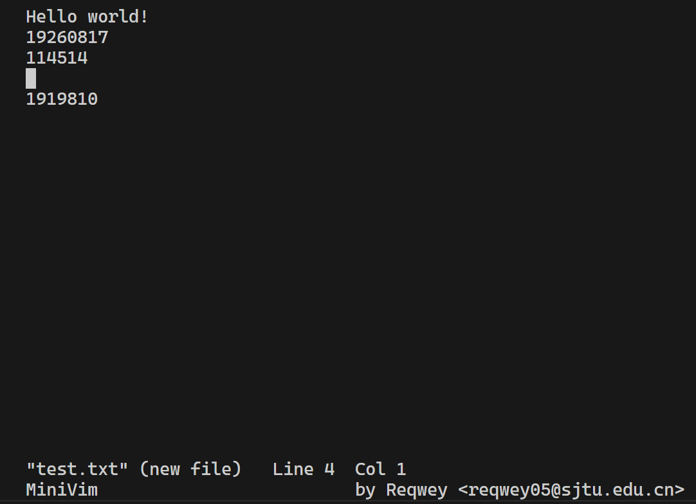

# MiniVim by Reqwey

## TUI

## Command line arguments
- [x] `-t`: open file in truncation mode
- [x] `-R`: open a file in read-only mode.
- [ ] `-W break/scroll`: wrap the lines by line breaks / scrolling

## Commands
- [x] `:w`: Save the file.
- [x] `:q`: Quit. Warn user if the file is changed but unsaved.
- [x] `:q!`: Force quit (i.e. Do not save the file and force quit.).
- [x] `:wq`: Save then quit.

## Shortcut Keys in NORMAL mode
- [x] <kbd>dd</kbd> delete the entire line that the cursor is currently on.
- [x] <kbd>0</kbd> Move the cursor to the beginning of the line.
- [x] <kbd>$</kbd> Move the cursor to the end of the line.
- [x] <kbd>w</kbd> Move forward one word (delimited by a white space or a new line).
- [x] <kbd>b</kbd> Move backward one word (delimited by a white space or a new line).

## Extension
> Not yet ready.

## Conventions
- [x] See tab as 4 white spaces

## Additional feature
- [x] Adjust the screen resizing and scrolling